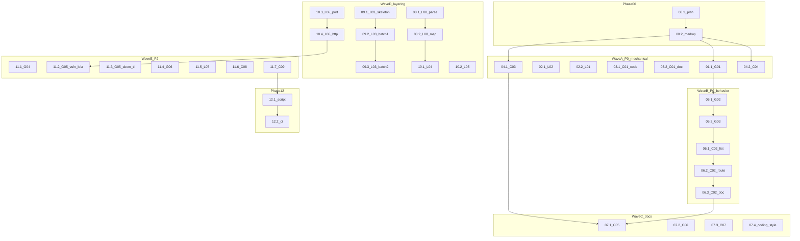

# Veil refactor — master plan (подфазы, малый diff)

Источник истины: [projects/veil/docs/veil-refactor.md](projects/veil/docs/veil-refactor.md) (23 находки + CI Yellow + doc drift).

Инварианты: [projects/veil/AGENTS.md](projects/veil/AGENTS.md), [coding-style.md](projects/veil/docs/agents/coding-style.md).

Эталон layering: [coderules/internal/usecase/runner.go](projects/veil/discovery/harvest/internal/sources/coderules/internal/usecase/runner.go).

**Правило diff:** одна подфаза = один PR = один коммит; целевой размер **&lt;150 LOC** (кроме mechanical move L03).

---

## Покрытие находок (ничего не забыто)

| ID | Подфаза | В плане ранее | Примечание |
|----|---------|---------------|------------|
| G01 | 01.1 | ✓ | |
| G02 | 05.1 | ✓ | P1 в audit, P0 blocker для G03 |
| G03 | 05.2 | ✓ | serial после G02 |
| G04 | 11.1 | ✓ | |
| G05 | 11.2, 11.3 | **sbom пропущен** | audit: vuln, lola, **sbom**, ti — 4 модуля |
| G06 | 11.4 | ✓ | |
| L01 | 02.2 | ✓ | |
| L02 | 02.1 | ✓ | |
| L03 | 09.1–09.3 | ✓ | split 3 PR (612 LOC) |
| L04 | 10.1 | ✓ | |
| L05 | 10.2 | ✓ | |
| L06 | 10.3, 10.4 | ✓ | port отдельно от HTTP |
| L07 | 11.5 | ✓ | |
| L08 | 08.1, 08.2 | ✓ | |
| O01 | — | defer | P3, только при росте proxybroker |
| C01 | 03.1, 03.2 | doc отдельно | |
| C02 | 06.1–06.3 | doc :3 status | line 3 «Implemented» + engage optional |
| C03 | 04.1 | ✓ | |
| C04 | 04.2 | ✓ | |
| C05 | 07.1 | ✓ | 6 locations в одном файле |
| C06 | 07.2 | ✓ | |
| C07 | 07.3 | ✓ | 2 файла |
| C08 | 11.6 | ✓ | |
| C09 | 11.7 | ✓ | decision: wire vs remove |
| CI guard | 12.1, 12.2 | ✓ | audit Executive summary |
| coding-style engage | 07.4 | добавлено | не в audit ID, но drift есть |
| Clean goroutine sites | — | explicit OOS | health.go, proxybroker mutex — не трогать |
| Verified accurate | — | explicit OOS | 754 skills, tool registry, engage category |

**Итого:** 23/23 ID покрыты; O01 отложен; CI + coding-style — доп. подфазы.

---

## Карта зависимостей



**Параллельные потоки (после 00.2):**
- **A:** 01.1 ∥ 02.1 ∥ 02.2 ∥ 03.1 ∥ 04.1 ∥ 04.2 ∥ 08.1
- **B:** 05.1→05.2→06.1→06.2→06.3 (serial)
- **C:** 07.x после 04.x и 06.3
- **D:** 08.x → 10.x; 09.x serial внутри ti
- **E:** 11.x mostly independent после Wave D

---

## Статус-таблица подфаз

| Sub | Branch suffix | ID | Est. LOC | Статус |
|-----|---------------|-----|----------|--------|
| 00.1 | `phase-00-1-plan` | — | doc | pending |
| 00.2 | `phase-00-2-markup` | markup | ~30 | pending |
| 01.1 | `phase-01-1-g01` | G01 | ~40 | pending |
| 02.1 | `phase-02-1-l02` | L02 | ~50 | pending |
| 02.2 | `phase-02-2-l01` | L01 | ~120 | pending |
| 03.1 | `phase-03-1-c01-code` | C01 | ~30 | pending |
| 03.2 | `phase-03-2-c01-doc` | C01 | doc | pending |
| 04.1 | `phase-04-1-c03` | C03 | doc | pending |
| 04.2 | `phase-04-2-c04` | C04 | doc | pending |
| 05.1 | `phase-05-1-g02` | G02 | ~50 | pending |
| 05.2 | `phase-05-2-g03` | G03 | ~15 | pending |
| 06.1 | `phase-06-1-c02-list` | C02 | ~40 | pending |
| 06.2 | `phase-06-2-c02-route` | C02 | ~30 | pending |
| 06.3 | `phase-06-3-c02-doc` | C02 | doc | pending |
| 07.1 | `phase-07-1-c05` | C05 | doc | pending |
| 07.2 | `phase-07-2-c06` | C06 | doc | pending |
| 07.3 | `phase-07-3-c07` | C07 | doc | pending |
| 07.4 | `phase-07-4-coding-style` | drift | doc | pending |
| 08.1 | `phase-08-1-l08-parse` | L08 | ~30 | pending |
| 08.2 | `phase-08-2-l08-map` | L08 | ~40 | pending |
| 09.1 | `phase-09-1-l03-skeleton` | L03 | ~80 | pending |
| 09.2 | `phase-09-2-l03-batch1` | L03 | move | pending |
| 09.3 | `phase-09-3-l03-batch2` | L03 | move | pending |
| 10.1 | `phase-10-1-l04` | L04 | ~60 | pending |
| 10.2 | `phase-10-2-l05` | L05 | ~50 | pending |
| 10.3 | `phase-10-3-l06-port` | L06 | ~25 | pending |
| 10.4 | `phase-10-4-l06-http` | L06 | ~80 | pending |
| 11.1 | `phase-11-1-g04` | G04 | ~10 | pending |
| 11.2 | `phase-11-2-g05-vuln-lola` | G05 | ~20 | pending |
| 11.3 | `phase-11-3-g05-sbom-ti` | G05 | ~15 | pending |
| 11.4 | `phase-11-4-g06` | G06 | ~30 | pending |
| 11.5 | `phase-11-5-l07` | L07 | ~20 | pending |
| 11.6 | `phase-11-6-c08` | C08 | ~5 | pending |
| 11.7 | `phase-11-7-c09` | C09 | ~40 | pending |
| 12.1 | `phase-12-1-script` | CI | ~80 | pending |
| 12.2 | `phase-12-2-makefile-ci` | CI | ~20 | pending |

Branch prefix: `feat/veil-refactor-` + suffix.

Phase plans: `projects/veil/.cursor/plans/veil-refactor-<sub>.plan.md`.

---

## Phase 00 — Prep

### 00.1 — Master plan в submodule
- Скопировать/синхронизировать этот файл → `projects/veil/.cursor/plans/veil-refactor_master.plan.md`
- Ссылка из [veil-refactor.md](projects/veil/docs/veil-refactor.md) на master plan

**Acceptance:** файл существует в veil submodule.

### 00.2 — Code markup (все unmarked sites)
Добавить `TODO(veil-refactor <ID>)` / `FIXME` per audit § Code markup:
- G04: `proxypool.go:158`
- G05: vuln `scrape.go` (3), `exploits.go` (2), lola `scrape.go` (2), **sbom `scrape.go` (2)**, ti `http_helpers.go` (1)
- G06: уже marked
- L03–L08, O01, C03–C09: per table line refs

**Acceptance:**
```bash
cd projects/veil && grep -rn "veil-refactor" --include="*.go" . | wc -l  # ≥23 sites
```

---

## Phase 01 — G01 panic-safe NATS

### 01.1 — `recover()` + test
**Файл:** [pkg/natsjet/pull.go](projects/veil/pkg/natsjet/pull.go) — closure + `handled bool`; sketch в veil-refactor.md § G01.

**Регрессия (не менять, только тесты):**
- `pipeline/ned/internal/consumer/consumer.go`
- `knowledge/ingest/internal/ingest/consumer.go`
- `pipeline/connector/nats/engage_consumer.go`

**Acceptance:**
```bash
cd projects/veil/pkg && env -u GOWORK go test ./natsjet/... -count=1 -run Panic
make test-pipeline test-knowledge
```
Удалить `FIXME(veil-refactor G01)`; kaizen в PR body.

---

## Phase 02 — P0 layering (раздельные PR)

### 02.1 — L02 Ping через port
1. `Ping(ctx) error` на [knowledge/connector/query](projects/veil/knowledge/connector/query)
2. [read.go](projects/veil/knowledge/serve/internal/usecase/read.go) — делегировать, убрать neo4j import

**Acceptance:** `make test-knowledge-serve test-graph-serve`

### 02.2 — L01 playbook_seed extract
1. `knowledge/ingest/internal/usecase/playbookseed/` + `repository.PlaybookSeedRepository`
2. [playbook_seed/main.go](projects/veil/knowledge/ingest/cmd/playbook_seed/main.go) — flags/env + `usecase.Run(ctx)`

**Acceptance:** `make test-knowledge` (ingest module tests)

---

## Phase 03 — C01 catalog

### 03.1 — Code: configurable path + warn
[resolve.go](projects/veil/pkg/playbook/cataloglink/resolve.go): `VENENO_CATALOG_PATH` (или URL), `slog.Warn` при 0 catalog files.

### 03.2 — Doc
[external-cybersecurity-skills.md](projects/veil/docs/playbooks/external-cybersecurity-skills.md): env var, veneno dependency.

**Acceptance 03.1:**
```bash
cd projects/veil/pkg && env -u GOWORK go test ./playbook/... -count=1
```

---

## Phase 04 — P0 docs (2 PR)

### 04.1 — C03
[platform-unified-access.md](projects/veil/docs/architecture/platform-unified-access.md): удалить `-f deploy/engage/compose*.yml` (lines ~149–150).

### 04.2 — C04
[mcp-agents.md](projects/veil/docs/agents/mcp-agents.md): удалить § veil-engage (~188–283); pointer как [docs/engage/README.md](projects/veil/docs/engage/README.md).

**Acceptance:** `grep -r "run-veil-engage" projects/veil/docs/` → 0.

---

## Phase 05 — Shutdown (serial)

### 05.1 — G02 cancellable read
[framed.go](projects/veil/pkg/mcp/framed.go): goroutine + `select` на `ctx.Done()`; unit-test cancellation.

### 05.2 — G03 remove os.Exit
[mcp/main.go](projects/veil/knowledge/serve/cmd/mcp/main.go): delete lines 105–108; `errors.Is(err, context.Canceled)` before fatal log.

**Acceptance:**
```bash
cd projects/veil/pkg/mcp && env -u GOWORK go test ./... -count=1
make test-knowledge-serve
```

---

## Phase 06 — C02 gateway (3 PR)

### 06.1 — listTools partial-result
[aggregator.go](projects/veil/platform/mcp-gateway/internal/aggregator/aggregator.go): fail only if **both** backends error; Warn on engage miss.

### 06.2 — routeTool explicit error
Same file ~line 183: JSON-RPC «engage backend not configured — see UNIFIED_MCP_ENGAGE_URL».

### 06.3 — Config + doc
- [config.go](projects/veil/platform/mcp-gateway/internal/config/config.go): engage optional semantics
- [platform-unified-access.md](projects/veil/docs/architecture/platform-unified-access.md): line 3 status + engage optional post-split note

**Acceptance:**
```bash
make test-platform-mcp-gateway test-platform-unified-edge
```

---

## Phase 07 — P1 docs (4 PR)

### 07.1 — C05
[platform-architecture.md](projects/veil/docs/architecture/platform-architecture.md): lines 5, 25, 93, 144–148, 159–160 → veneno.

### 07.2 — C06
Same file: remove status table ~13–18, line 171 `test-engage-parity`.

### 07.3 — C07
[deploy-platform-hybrid.md](projects/veil/docs/deploy/deploy-platform-hybrid.md), [agent-evaluation-gaia.md](projects/veil/docs/agents/agent-evaluation-gaia.md).

### 07.4 — coding-style drift (extra)
[coding-style.md](projects/veil/docs/agents/coding-style.md): убрать `engage/` из Repository map и runtime table; ссылка на veneno + `pipeline/engage-events`.

**Acceptance:**
```bash
grep -rE "test-engage-parity|engage/serve|deploy/engage" projects/veil/docs/ \
  | grep -v "docs/engage/README"
```

---

## Phase 08 — L08 NVD dedupe (2 PR)

### 08.1 — parse package
[pipeline/pkg/nvd/parse/types.go](projects/veil/pipeline/pkg/nvd/parse/types.go) → import `pkg/vuln/domain`.

### 08.2 — map package
[pipeline/pkg/nvd/map/map.go](projects/veil/pipeline/pkg/nvd/map/map.go): delete `FromNVD`, use domain types.

**Acceptance:** `make test-pipeline test-pkg-domain`

---

## Phase 09 — L03 TI split (3 PR)

### 09.1 — Skeleton
Создать `ti/internal/usecase/`; перенести `Runner`, `NewRunner`, `Run` из [feeds/runner.go](projects/veil/discovery/harvest/internal/sources/ti/internal/feeds/runner.go); wire в factory/cmd.

### 09.2 — Batch 1 feeds
Перенести `runKEV`, `runPTRSS`, `runURLhaus` + их repo calls (lines per audit L03).

### 09.3 — Batch 2 + cleanup
`runThreatFoxAPI`, `runThreatFoxExport`, `runMalwareBazaar`, `runFeodo`, `runOpenPhish`; в `internal/feeds/` оставить только fetch/parse helpers.

**Acceptance:** `make test-discovery`; `go test ./...` в `sources/ti/`.

---

## Phase 10 — L04–L06 feeds boundary (4 PR)

### 10.1 — L04 lola
[lola/usecase/scrape.go](projects/veil/discovery/harvest/internal/sources/lola/internal/usecase/scrape.go): constructor `*feeds.Client`; move `fetchBytesDirect` → feeds.

### 10.2 — L05 ds
[ds/usecase/ingest.go](projects/veil/discovery/harvest/internal/sources/ds/internal/usecase/ingest.go): same pattern.

### 10.3 — L06a port
Add `PublishNVDPage` to `VulnerabilityRepository`; remove type-assertion scrape.go:217–222.

### 10.4 — L06b HTTP
[vuln/usecase/scrape.go](projects/veil/discovery/harvest/internal/sources/vuln/internal/usecase/scrape.go) + `exploits.go`: `*feeds.Client`, move `downloadNVDPage` retry logic.

**Acceptance:** `make test-discovery` (each PR).

---

## Phase 11 — Wave E (7 PR, O01 deferred)

### 11.1 — G04
[proxypool.go](projects/veil/discovery/pkg/proxypool/proxypool.go): `select` on `req.Context().Done()`.

### 11.2 — G05 vuln + lola
- `vuln/.../scrape.go:133,140,149`; `exploits.go:68,248`
- `lola/.../scrape.go:240,253`
Pattern: `pkg/natsjet/pull.go` select backoff.

### 11.3 — G05 sbom + ti (**добавлено — было пропущено**)
- `sbom/.../scrape.go:113,137`
- `ti/.../http_helpers.go:26`

### 11.4 — G06
[metrics_server.go](projects/veil/pkg/observability/metrics_server.go): return err chan or callback; update one `cmd/*/main.go` pilot, then rest.

### 11.5 — L07
[ds/.../graphstore.go](projects/veil/discovery/harvest/internal/sources/ds/internal/usecase/graphstore.go) → new `ds/internal/repository/`.

### 11.6 — C08
[factory/register.go](projects/veil/discovery/harvest/internal/factory/register.go):28 — «unknown scrape source».

### 11.7 — C09
[vuln/storage/neo4j.go](projects/veil/knowledge/ingest/internal/sources/vuln/storage/neo4j.go) `FindByCVE`: **decision PR** — wire full relations OR delete from port + fakes.

**O01 (proxybroker split):** не планируется unless LOC &gt;600 или новые handlers.

---

## Phase 12 — CI guard (2 PR)

### 12.1 — Script
`projects/veil/scripts/verify_import_boundaries.py` (адаптация egregore pattern):
- no `discovery`↔`pipeline`↔`knowledge` cross-imports
- no I/O imports in any `domain/` package

### 12.2 — Makefile + CI
`make verify-import-boundaries`; GitHub Actions job.

**Acceptance:** intentional violation → exit 1.

---

## Out of scope (audit explicit)

- **Clean goroutine sites** — health.go, proxybroker mutex, HTTP shutdown pattern, errgroup wiring
- **Large cohesive files** — envelope.go, github.go, neo4j stores, query/service.go, router.go
- **Verified accurate** — 754 skills, MCP tool registry, engage read-only category
- **engage-events pipeline** — работает; только `make test-engage-events-pipeline` как regression
- **Graph pack release** — не в scope refactor
- **O01** — P3 defer

---

## Verify matrix

| Подфаза затрагивает | Команда |
|---------------------|---------|
| pkg/natsjet, mcp | `make test-pkg-shared` |
| discovery | `make test-discovery` |
| pipeline, L08 | `make test-pipeline` |
| knowledge | `make test-knowledge` |
| platform | `make test-platform-mcp-gateway test-platform-unified-edge` |
| C01, C02 | `make test-graph-read-smoke` |
| engage bridge | `make test-engage-events-pipeline` |

**Финальный gate:** `cd projects/veil && make test-platform-p7`

---

## Оценка объёма

| Wave | Подфазы | PRs |
|------|---------|-----|
| 00 Prep | 2 | 2 |
| A P0 mechanical | 01.1, 02.1–02.2, 03.1–03.2, 04.1–04.2 | 7 |
| B P0 behavior | 05.1–05.2, 06.1–06.3 | 5 |
| C P1 docs | 07.1–07.4 | 4 |
| D layering | 08.1–08.2, 09.1–09.3, 10.1–10.4 | 9 |
| E P2 | 11.1–11.7 | 7 |
| CI | 12.1–12.2 | 2 |
| **Итого** | **36 подфаз** | **~36 PR** |

*(O01 не считается; audit оценивал 17–23 PR при более крупных фазах.)*

---

## Critic checklist (каждая подфаза)

- [ ] 1 ID (или 1 logical slice) per PR; diff &lt;150 LOC где возможно
- [ ] `TODO(veil-refactor <ID>)` удалён в том же PR
- [ ] `make test-*` из подфазы зелёные
- [ ] Master plan sub-row → `done` + merge SHA
- [ ] Docs per [core-agent-documentation.mdc](.cursor/rules/core-agent-documentation.mdc)
