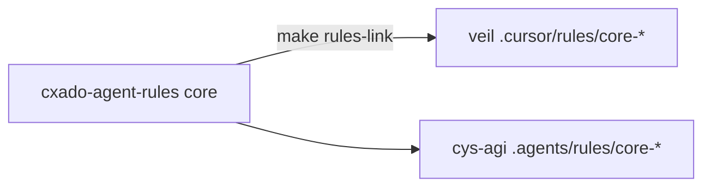
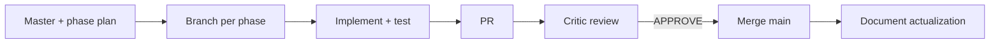

# Veil Cursor rules — index & adaptation guide

Canonical rules live in [`.cursor/rules/`](../../.cursor/rules/). **Core rules** are symlinks from [cxado-agent-rules](https://github.com/butbeautifulv/cxado-agent-rules) via `make rules-link` in the cxado meta-repo.

## DRY layers

| Layer | Location | Purpose |
|-------|----------|---------|
| **Core** | `core-*.mdc` → `shared/agent-rules/core/` | Generic karpathy, critic, branches, kaizen, docs, workflow |
| **Veil overlay** | `veil-*.mdc` (4 files) | Knowledge layers, `make test-knowledge`, JCSF, ingest version |

**Pentest rules** moved to [veneno](https://github.com/butbeautifulv/veneno) (`project-workflow.mdc`, `project-security.mdc`).

## Agent chain

## Rule catalog

### Core (symlinks — do not edit in Veil repo)

| Symlink | alwaysApply | Purpose |
|---------|-------------|---------|
| [core-karpathy-guidelines.mdc](../../.cursor/rules/core-karpathy-guidelines.mdc) | yes | Think first, surgical diffs, verifiable DoD |
| [core-workflow-chain.mdc](../../.cursor/rules/core-workflow-chain.mdc) | yes | Master → branch → critic → merge chain |
| [core-agent-critic.mdc](../../.cursor/rules/core-agent-critic.mdc) | yes | Review phase PRs; APPROVE / REQUEST_CHANGES / BLOCKED |
| [core-parallel-branches.mdc](../../.cursor/rules/core-parallel-branches.mdc) | yes | One branch per phase; merge discipline |
| [core-agent-documentation.mdc](../../.cursor/rules/core-agent-documentation.mdc) | yes | Plans, README, CONTRIBUTING after merge |
| [core-kaizen.mdc](../../.cursor/rules/core-kaizen.mdc) | yes | 5 Whys on failures; Kaizen note on bugfix PRs |

### Veil overlay (edit here)

| Rule | alwaysApply | Role | Purpose |
|------|-------------|------|---------|
| [veil-agent-workflow.mdc](../../.cursor/rules/veil-agent-workflow.mdc) | yes | all | 4-layer Go arch, `make test-*`, commit, push |
| [veil-agent-subagents.mdc](../../.cursor/rules/veil-agent-subagents.mdc) | no | orchestrator | Spawn implementers from manifest |
| [veil-agent-security-frameworks.mdc](../../.cursor/rules/veil-agent-security-frameworks.mdc) | no | security tasks | JCSF/DAF/OWASP refs → veil-controls.yaml |
| [veil-ingest-graph-version.mdc](../../.cursor/rules/veil-ingest-graph-version.mdc) | no | ingest changes | Bump GRAPH_PACK_VERSION when wire/sources change |

**Skill (not a rule):** [veil-karpathy-guidelines/SKILL.md](../../.cursor/skills/veil-karpathy-guidelines/SKILL.md) — generic part in [cxado-skills/agent/karpathy-guidelines](https://github.com/butbeautifulv/cxado-skills) when using meta-repo.

## Orchestrator vs implementer

| Session | Primary rules |
|---------|----------------|
| **Orchestrator / critic** | core-agent-critic, core-karpathy, core-kaizen, core-agent-documentation, veil-subagents (when spawning) |
| **Implementer (phase branch)** | veil-agent-workflow, core-parallel-branches, core-karpathy, core-kaizen |
| **Ingest / graph work** | + veil-ingest-graph-version |
| **Framework mapping** | + veil-agent-security-frameworks |

## Adaptation matrix (Veil → other project)

Use when porting to a new repo. **Core rules** — `make rules-link`; add thin **project overlay** only.

| Veil overlay | Adapt | Typical replacements |
|--------------|-------|----------------------|
| `veil-agent-workflow` | **required** | Stack architecture; test commands |
| `veil-agent-security-frameworks` | optional | Project security controls |
| `veil-agent-subagents` | optional | Manifest path; max parallel subagents |
| `veil-ingest-graph-version` | **drop** if N/A | Veil-specific graph pack versioning |

Core rules (`karpathy`, `critic`, `branches`, `kaizen`, `documentation`) — **no copy**; link from hub.

### Worked example: Fish (Next.js)

Fish uses `.agents/rules/` with copied rules (pre-DRY). New projects should use cxado-agent-rules + overlay pattern.

| Veil overlay | Fish equivalent | Key change |
|--------------|-----------------|------------|
| `veil-agent-workflow` | `fish-agent-workflow` | 4 Go layers → Next.js routes; `make test-*` → `npm run typecheck/lint/build` |
| `veil-agent-security-frameworks` | `fish-agent-security` | Credential encryption, admin auth |

**Path convention:** Veil uses `.cursor/rules/`; Fish and cys-agi use `.agents/rules/`. Both work with Cursor.

## Related

- [AGENTS.md](../../AGENTS.md) — agent chain summary
- [coding-style.md](coding-style.md) — Go layer boundaries
- [external-security-frameworks.md](../external/external-security-frameworks.md) — JCSF/DAF reference layer
