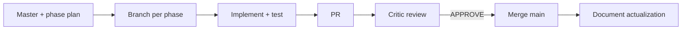

# Veil Cursor rules — index & adaptation guide

Canonical rules live in [`.cursor/rules/`](../../.cursor/rules/). This document is the single overview for orchestrators, implementers, and **adapting** the rule set to other repos (see Fish example below).

## Agent chain

## Rule catalog

| Rule | alwaysApply | Role | Purpose |
|------|-------------|------|---------|
| [veil-agent-workflow.mdc](../../.cursor/rules/veil-agent-workflow.mdc) | yes | all | End-of-task: architecture, tests, commit, push |
| [veil-karpathy-guidelines.mdc](../../.cursor/rules/veil-karpathy-guidelines.mdc) | yes | all | Think first, surgical diffs, verifiable DoD |
| [veil-agent-critic.mdc](../../.cursor/rules/veil-agent-critic.mdc) | yes | orchestrator | Review phase PRs; APPROVE / REQUEST_CHANGES / BLOCKED |
| [veil-agent-parallel-branches.mdc](../../.cursor/rules/veil-agent-parallel-branches.mdc) | yes | implementer | One branch per phase; merge discipline |
| [veil-agent-documentation.mdc](../../.cursor/rules/veil-agent-documentation.mdc) | yes | all | Plans, README, CONTRIBUTING after merge |
| [veil-agent-kaizen-metacognition.mdc](../../.cursor/rules/veil-agent-kaizen-metacognition.mdc) | yes | all | 5 Whys on failures; Kaizen note on bugfix PRs |
| [veil-agent-subagents.mdc](../../.cursor/rules/veil-agent-subagents.mdc) | no | orchestrator | Spawn implementers from manifest |
| [veil-agent-security-frameworks.mdc](../../.cursor/rules/veil-agent-security-frameworks.mdc) | no | security tasks | JCSF/DAF/OWASP refs → veil-controls.yaml |
| [veil-ingest-graph-version.mdc](../../.cursor/rules/veil-ingest-graph-version.mdc) | no | ingest changes | Bump GRAPH_PACK_VERSION when wire/sources change |

**Skill (not a rule):** [veil-karpathy-guidelines/SKILL.md](../../.cursor/skills/veil-karpathy-guidelines/SKILL.md) — canonical in [cxado-skills](https://github.com/butbeautifulv/cxado-skills) when using meta-repo.

## Orchestrator vs implementer

| Session | Primary rules |
|---------|----------------|
| **Orchestrator / critic** | critic, karpathy, kaizen, documentation, subagents (when spawning) |
| **Implementer (phase branch)** | workflow, parallel-branches, karpathy, kaizen |
| **Ingest / graph work** | + ingest-graph-version |
| **Framework mapping** | + security-frameworks |

## Adaptation matrix (Veil → other project)

Use when porting rules to a new repo. **Rename** `veil-*` → `<project>-*`; do not keep two active rule sets.

| Veil rule | Adapt | Typical replacements |
|-----------|-------|----------------------|
| `veil-agent-workflow` | **required** | Stack architecture; test commands (`make test-*` → project-specific) |
| `veil-karpathy-guidelines` | **required** | Branch prefix (`engage/phase-*` → `<project>/phase-*`); plan paths |
| `veil-agent-critic` | **required** | Architecture invariants; CI gate commands |
| `veil-agent-parallel-branches` | **required** | Branch naming pattern |
| `veil-agent-documentation` | **required** | Doc paths (README, AGENTS, plans dir) |
| `veil-agent-kaizen-metacognition` | **required** | Gemba commands (reproduce failure locally) |
| `veil-agent-security-frameworks` | optional | Project security controls (may become `*-agent-security`) |
| `veil-agent-subagents` | optional | Manifest path; max parallel subagents |
| `veil-ingest-graph-version` | **drop** if N/A | Veil-specific graph pack versioning |

### Worked example: Fish (Next.js)

Fish adapted Veil rules into [`.agents/rules/`](file:///home/bbv/Desktop/fish/fish/.agents/rules/) — see [fish_master.plan.md](file:///home/bbv/Desktop/fish/fish/docs/plans/fish_master.plan.md) § «Адаптация `.agents/rules`».

| Veil | Fish | Key change |
|------|------|------------|
| `veil-agent-workflow` | `fish-agent-workflow` | 4 Go layers → `app/(public)`, `api`, `(admin)`, `lib`; `make test-*` → `npm run typecheck/lint/build` |
| `veil-karpathy-guidelines` | `fish-karpathy-guidelines` | Branch `fish/phase-NN-slug` |
| `veil-agent-security-frameworks` | `fish-agent-security` | Credential encryption, admin auth, retention |
| `veil-ingest-graph-version` | *(removed)* | Not applicable |

**Path convention:** Veil uses `.cursor/rules/`; Fish and cys-agi use `.agents/rules/`. Both work with Cursor; pick one per repo and document in AGENTS.md.

## Related

- [AGENTS.md](../../AGENTS.md) — agent chain summary
- [coding-style.md](coding-style.md) — Go layer boundaries
- [external-security-frameworks.md](../external/external-security-frameworks.md) — JCSF/DAF reference layer
